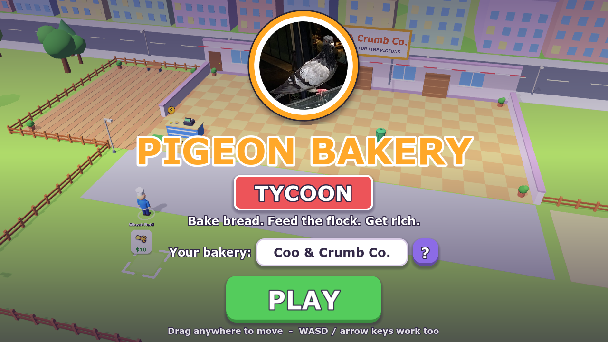
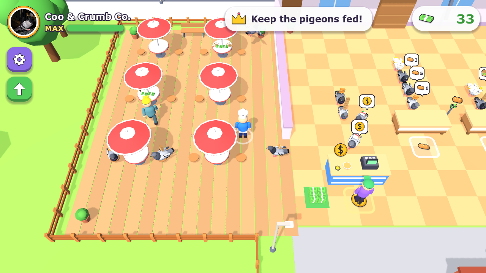
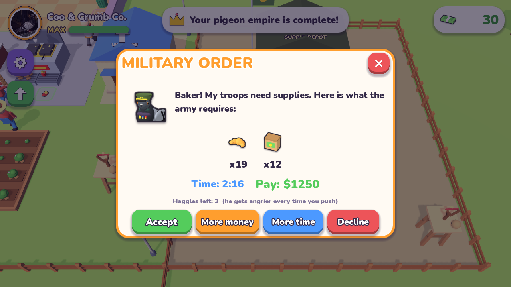
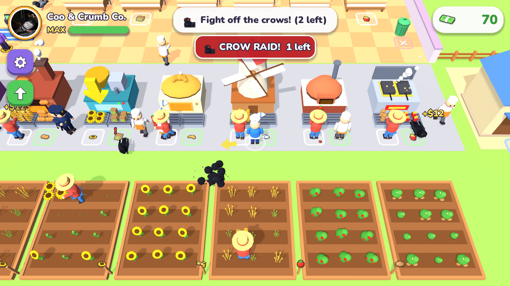

# Pigeon Bakery Tycoon

A mobile-style "arcade idle" tycoon (like the playable ads) built in Godot 4.4. You run a bakery whose only customers are pigeons. The company logo is the pigeon photo, and every pigeon customer is modelled on it.






**Play in your browser (phones too):** https://randomprojects1234.github.io/pigeon-bakery-tycoon/

**Download:** grab `Pigeon Bakery Tycoon.exe` from the [latest release](../../releases/latest). It's one file with nothing to install (Windows, 64-bit).

## Play

- **`build/Pigeon Bakery Tycoon.exe`**: the finished game in one file.
- To run from source, open the folder in Godot 4.4 (Compatibility renderer).
- The `.bat` launchers assume Godot lives at `D:\Programes\...`. Edit the path at the top of each one to match your install.
  - `Start Pigeon Bakery Tycoon.bat` runs the exe, or the project with Godot if there's no build.
  - `Build EXE.bat` rebuilds the exe into `build/`. It needs Godot's export templates.
  - `Open in Godot Editor.bat` opens the project in Godot.

Name your company on the title screen (the `?` button picks a random name). You can rename it later in Settings. The name shows on the big shop sign, the HUD badge and the Founder's Statue.

## Controls

- Drag anywhere on the screen for a floating joystick (mouse or touch).
- WASD or the arrow keys also work.
- Everything else happens by standing on things.

## How it plays

1. **Harvest.** Walk through a field and ripe plants pop into the stack in your arms.
2. **Make.** Drop crops on a machine's LEFT pad and pick up products from its RIGHT pad.
3. **Stock.** Stand on the pad in front of a shelf.
4. **Sell.** Pigeons fly in and queue behind the shelves. They take what they ordered (shown in their bubble) and queue at the till. Stand on the till spot to ring them up.
5. **Collect** the cash pile, then stand on the dashed buy zones to pour money in and unlock the next thing.

Along the way you unlock:

- **Products**: Bread ($5), Birdseed ($9), Croissants ($16), Pizza ($30), Fries ($24), and the **All-Ingredient Pie** ($500). The pie needs flour, tomatoes, potatoes and sunflower seeds. It is the most expensive item, so only the odd rich pigeon buys one.
- **Supply chain**: wheat, sunflower, tomato and potato fields; the flour mill; the pizza oven, which needs flour **and** tomatoes.
- **Staff**: cashier, farmers, bakers and a janitor. Each works one station.
- **Cafe tables**: pigeons eat there, tip, and leave crumbs to clean.
- **Manager's Office**: upgrades for speed, carry size, prices, machine speed and staff.
- **The Back Lot**: more fields, the Pigeon Fountain, the VIP Golden Perch (VIP pigeons pay 3x) and the **Founder's Statue**. The statue is the finale; after it you can open a new branch with +50% prices.

## Military + Security update (after the Founder's Statue)

- **General Coo** of the Pigeon Army flies in: the Crow Clans are at war with the city's pigeons, and his soldiers need feeding.
- **The outpost:** buy the **Military Outpost** (new land east of the yard) and build the **Supply Depot**. The army truck, the General and his soldiers wait there.
- **Orders:** military orders arrive at random: a list of products, a deadline and a reward. Before accepting you can **bargain** for more money or more time. Every push makes the General angrier, and two bad pushes and he storms off. The army never orders pie.
- **Delivering:** drop the products on the depot's supply crate. Finish in time to get paid and climb the ranks, from Recruit Supplier to The General's Baker. Fail and your reputation drops. **Supply Runners** can be hired to haul orders for you.
- **Crow Clan raids:** after a siren, a raid flies in from one side (with a bandana-wearing **Crow Boss** every third raid). They steal from shelves, machine trays, the cash pile and your **wallet** (the office safe).
- **Defending:** walk into crows to bonk them. A knocked-out crow drops everything it stole, and you get a bounty. Build a **Security Booth**, hire **Guards** who chase crows, and place **Seed Slingshot** turrets around the base.

Events:

- **Crows** land on shelves and steal. Walk up to them to scare them off; they drop the loot.
- **Pigeon Rush** sends a flock at once.

The game autosaves every 10 s and on quit. Save file: `%APPDATA%\Godot\app_userdata\Pigeon Bakery Tycoon\save.json`. If you have hired a cashier, your staff earn offline income for up to 2 hours.

A full run takes about 80-90 minutes, measured with the autoplayer.

## Project layout

- `scripts/data/layout.gd`: the whole map and every buy zone (costs, requirements) as data.
- `scripts/world/`:
  - `world.gd` spawns stations, pigeons, crows and staff, and runs the camera.
  - `world_builder.gd` builds the scenery.
  - `models.gd`, `pigeon_rig.gd` and `human_rig.gd` hold the procedural models.
  - `mesh_builder.gd` merges primitives into single vertex-coloured meshes.
- `scripts/stations/`: field, machine, shelf, register, table, office, trash, decor, buy zone.
- `scripts/actors/`: player, pigeon, crow, worker, and `bot.gd` (the dev autoplayer).
- `scripts/ui/`: HUD, title menu, widget kit.
- `tools/gen_art.py` draws the logo (cut from `tools/pigeon_photo.webp`) and the UI glyphs.
- `tools/gen_audio.py` synthesises every sound and the music loop.
- `tools/outline_icons.py` adds sticker outlines to the item icons baked from the 3D models.

Regenerate assets:

1. `py -3.13 tools/gen_art.py`
2. `py -3.13 tools/gen_audio.py`
3. `godot --path . -- --bake-icons`
4. `py -3.13 tools/outline_icons.py`
5. `godot --headless --import --path .`

## Web build

The web version is Godot's built-in Web export: the `Web` preset in `export_presets.cfg`, with no thread support so it runs on GitHub Pages. Export to `build/web/`, then push that folder (plus an empty `.nojekyll`) to the `gh-pages` branch.

```
godot --headless --path . --export-release "Web" build/web/index.html
```

## Dev flags (after `--`)

| Flag | Effect |
|---|---|
| `--fresh` | ignore the save |
| `--auto` | autoplayer plays the game |
| `--timescale 3` | fast-forward |
| `--log` | print unlocks, upgrades and bot tasks |
| `--quit-after N` | print a report after N real seconds, then quit |
| `--unlock all` / `upto:<id>` / `a,b` | pre-unlock zones |
| `--autoshot 3,10` | save screenshots to `shots/`, then quit |
| `--cam x,z` | start the player at x,z |
| `--menu` | keep the title menu in test runs |
| `--pose pigeon` | close-up line-up of the pigeon variants |
| `--allow-save` | let test runs read and write the save |
| `--unlock endgame` | everything up to the statue, General Coo already met |
| `--raid-in N` / `--offer-in N` | first crow raid / military order after N seconds |
| `--show-ui` | show dialogs and offers in test runs (instead of auto-accepting) |

Full headless balance run:

```
godot --headless --path . --fixed-fps 60 -- --fresh --auto --log --timescale 3 --quit-after 1400
```

## License

MIT, see [LICENSE](LICENSE). The bundled font is [Nunito](https://github.com/googlefonts/nunito), used under the SIL Open Font License (`assets/fonts/OFL.txt`). The pigeon in the logo is a real pigeon who did not sign anything.
